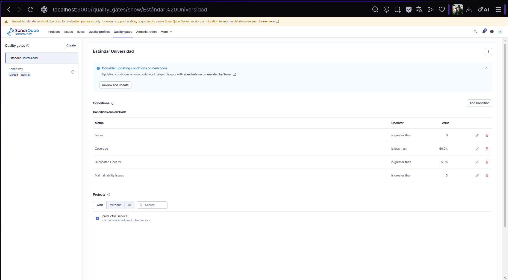
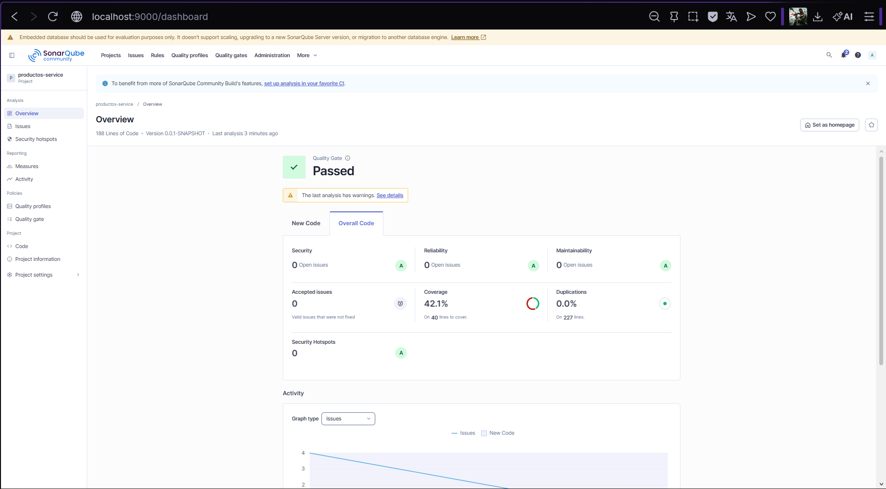
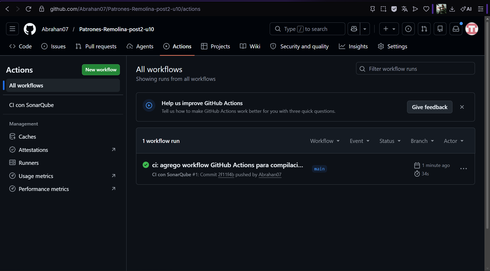

# Productos Service — Quality Gate, Correcciones y GitHub Actions

Proyecto Spring Boot con análisis de calidad mediante SonarQube. Este repositorio documenta el ciclo completo de inspección: configuración de Quality Gate personalizado, corrección de bugs y code smells identificados en el análisis inicial, re-ejecución del análisis para confirmar mejoras, e integración en pipeline de GitHub Actions.

---

## Prerrequisitos

- Java 21
- Maven 3.9+
- Docker Desktop instalado y en ejecución

---

## Cómo ejecutar el proyecto

### Compilar y ejecutar pruebas

```bash
mvn clean verify
```

### Iniciar la aplicación

```bash
mvn spring-boot:run
```

---

## Cómo levantar SonarQube con Docker

```bash
docker run -d \
  --name sonarqube \
  -p 9000:9000 \
  -e SONAR_ES_BOOTSTRAP_CHECKS_DISABLE=true \
  sonarqube:community
```

Esperar hasta ver en los logs:

```bash
docker logs -f sonarqube
# Esperar: "SonarQube is operational"
```

Acceder en `http://localhost:9000` con credenciales `admin / admin`.

---

## Cómo ejecutar el análisis SonarQube localmente

```bash
mvn clean verify sonar:sonar -Dsonar.token=TU_TOKEN
```

Ver resultados en:

```
http://localhost:9000/dashboard?id=com.universidad%3Aproductos-service
```

> El análisis SonarQube se ejecuta localmente con Docker ya que el servidor local no es accesible desde los runners de GitHub Actions. El pipeline de CI ejecuta compilación, pruebas y reporte JaCoCo automáticamente.

---

## Quality Gate — Estándar Universidad

Quality Gate personalizado configurado en SonarQube con las siguientes condiciones:

| Métrica | Operador | Umbral |
|---------|----------|--------|
| Issues | is greater than | 0 |
| Coverage | is less than | 60% |
| Duplicated Lines (%) | is greater than | 5% |
| Maintainability Issues | is greater than | 5 |

---

## Comparativa antes y después de las correcciones

| Categoría | Análisis Inicial (Post-1) | Análisis Final (Post-2) | Mejora |
|-----------|--------------------------|------------------------|--------|
| Reliability (Bugs) | 2 issues — Rating C | 0 issues — Rating A | ✅ |
| Maintainability | 4 issues — Rating A | 0 issues — Rating A | ✅ |
| Security | 0 issues — Rating A | 0 issues — Rating A | ✅ |
| Coverage | 4.4% | 42.1% | ✅ |
| Duplicaciones | 0.0% | 0.0% | ✅ |

---

## Correcciones aplicadas

### Bug corregido — `orElse(null)` en `ProductoService`

**Antes:**
```java
public Producto buscar(Long id) {
    return repo.findById(id).orElse(null); // Bug: retorna null
}
```

**Después:**
```java
public Producto buscar(Long id) {
    return productoRepository.findById(id)
            .orElseThrow(() ->
                    new NoSuchElementException("Producto no encontrado: " + id));
}
```

**Impacto:** Elimina el riesgo de `NullPointerException` en capas superiores. El método ahora lanza una excepción descriptiva cuando el producto no existe.

---

### Code Smell 1 corregido — Inyección por campo en `ProductoService`

**Antes:**
```java
@Autowired
private ProductoRepository repo; // Code Smell: campo no final
```

**Después:**
```java
private final ProductoRepository productoRepository;

public ProductoService(ProductoRepository productoRepository) {
    this.productoRepository = productoRepository;
}
```

**Impacto:** El campo es ahora `final` e inmutable. La inyección por constructor es la práctica recomendada por Spring y facilita las pruebas unitarias.

---

### Code Smell 2 corregido — Inyección por campo en `ProductoController`

**Antes:**
```java
@Autowired
private ProductoService service; // Code Smell: inyección por campo
```

**Después:**
```java
private final ProductoService service;

public ProductoController(ProductoService service) {
    this.service = service;
}
```

**Impacto:** Mismo beneficio que en el servicio — campo inmutable e inyección explícita por constructor.

---

### Code Smell 3 corregido — `equals("")` reemplazado por `isBlank()`

**Antes:**
```java
if (n == null || n.equals("")) {
    throw new IllegalArgumentException("nombre requerido");
}
```

**Después:**
```java
if (nombre == null || nombre.isBlank()) {
    throw new IllegalArgumentException("El nombre no puede estar vacío");
}
```

**Impacto:** `isBlank()` detecta también cadenas con solo espacios en blanco, cubriendo más casos de entrada inválida.

---

### Code Smell 4 corregido — Método largo refactorizado

**Antes:** `procesarProducto()` concentraba validación, construcción y persistencia en un solo método con alta complejidad ciclomática y parámetros no utilizados (`cat`, `activo`, `proveedor`).

**Después:** Se extrajo `validarDatos()` como método privado y se eliminaron los parámetros no utilizados:

```java
// Método principal — solo orquestación
public Producto procesarProducto(String nombre, Double precio, Integer stock) {
    validarDatos(nombre, precio, stock);
    Producto producto = new Producto();
    producto.setNombre(nombre.strip());
    producto.setPrecio(precio);
    producto.setStock(stock);
    return productoRepository.save(producto);
}

// Método extraído — validación separada
private void validarDatos(String nombre, Double precio, Integer stock) {
    if (nombre == null || nombre.isBlank())
        throw new IllegalArgumentException("El nombre no puede estar vacío");
    if (precio == null || precio <= 0)
        throw new IllegalArgumentException("El precio debe ser mayor a cero");
    if (precio > 999999)
        throw new IllegalArgumentException("El precio excede el máximo permitido");
    if (stock == null || stock < 0)
        throw new IllegalArgumentException("El stock no puede ser negativo");
}
```

**Impacto:** Complejidad ciclomática reducida, método principal más legible y responsabilidad única aplicada.

---

## Pruebas unitarias agregadas

Se agregaron 5 pruebas unitarias en `ProductoServiceTest` para aumentar la cobertura del 4.4% al 42.1%:

| Test | Descripción |
|------|-------------|
| `buscar_productoNoExiste_lanzaNoSuchElementException` | Verifica que buscar un id inexistente lanza excepción |
| `buscar_productoExiste_retornaProducto` | Verifica que buscar un id existente retorna el producto |
| `procesarProducto_nombreVacio_lanzaIllegalArgumentException` | Verifica validación de nombre vacío |
| `procesarProducto_precioNegativo_lanzaIllegalArgumentException` | Verifica validación de precio negativo |
| `procesarProducto_datosValidos_guardaYRetorna` | Verifica flujo exitoso de creación |

---

## Pipeline GitHub Actions

El workflow `.github/workflows/ci.yml` se ejecuta automáticamente en cada push a `main`:

1. Checkout del repositorio
2. Configurar Java 21 (Temurin)
3. Compilar y ejecutar pruebas con `mvn clean verify`
4. Generar reporte JaCoCo
5. Mostrar resumen de resultados

---

## Evidencias

### Quality Gate — Estándar Universidad configurado



### Dashboard SonarQube — Análisis final con correcciones aplicadas


### GitHub Actions — Workflow en verde

